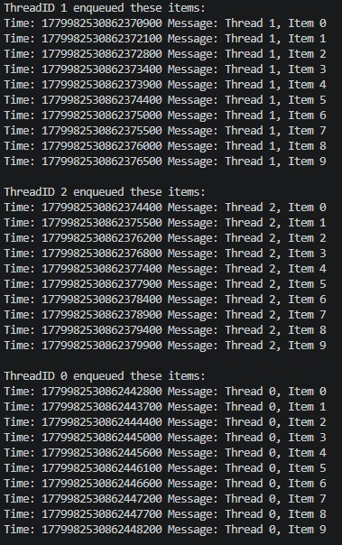

### LogEntry shape design
In the basic implementation of SPSCQueue and MPSCManager, we allow for SPSCQueue to interact with any primitive type with template parameters, while MPSCManager only deals with LogEntry items in the SPSCQueues.

The current implementation of LogEntry is very simple:
```C++
struct LogEntry {
    int threadID;
    int payload;
}
```
This allows for a minium viable product to be built rapidly. However, since the final product aims to mimic an actual logging system, there needs to be additional fields to make the LogEntry more robust and support the functionalities of a logging system:
```C++
struct LogEntry {
    int threadID; //allows tracking the origin of the log
    u64_t timestamp; // allows reconstruction of chronological log timeline
    int state; //allows for us to track the process state of the log, see section on state transition for more information
    char message[MESSAGE_SIZE]; //a char[] to store free text message for the log, see below for further discussion on MESSAGE_SIZE
}
```
With this definition, each item's purpose is now fully consistent with a practical logging system. 

### MESSAGE_SIZE calculation
`MESSAGE_SIZE` is defined as the cache line size (`std::hardware_destructive_interference_size`) minus the size of the rest of the LogEntry member variables. This size definition is important for **cache line alignment**. The full LogEntry item is now the same size as a cache line, this prevents false sharing should we ever try to refer to the SPSCQueues by item memory address in a multi-threaded environment. For example, if LogEntry is smaller than one cache line, accessing a particular memory slot would cause adjacent slots to be loaded as well. If the logging thread is a producer (i.e. LoggerManager), then writing to the slot now marks the entire cache line as dirty by the MESI protocol, and when logger threads now tries to access different slots, cache thrashing occurs.

The solution is therefore to ensure each LogEntry is exactly one cache line in size. The trade-off to this approach is we now lose the **cache locality** benefits of contiguous containers like `std::array`, which is the underlying container used for all SPSCQueues. However, avoiding the latency created by false sharing provides more immediate benefits than the possibility of cache locality speed up for our current design, as we do not ensure logger threads will be allocated adjacent blocks of memory to work currently given our round-robin distribution style. The trade-off is therefore sufficiently justified.

### Curiously Recurring Template Pattern (CRTP) SPSCQueue
Now that we have sufficiently justified the shape and size of LogEntry, the implementation thus requires a SPSCQueue that could handle writing these particular fields, i.e. handling non-primitive types. The original solution just accepts a copy of the non-primitive type, and assign that to the slot in memory. However, in a low-latency system, copying could introduce heap allocation jitter, e.g. copying a std::string.

The solution is to use explicit overwrite behaviour rather than default copying. A  refactor to a CRTP architecture is therefore needed to introduce polymorphic behaviour to the SPSCQueue while avoiding dynamic polymorphisim overhead.

We first create the base template class SPSCQueueBase, and have default copying behaviour captured by SPSCQueue. While for our specific use case (the LogEntry type we have defined), we have LogEntryQueue which defines the desired overwrite behaviour for enqueues.

An important note for implementation that exposes a key weakness of CRTP: the derived class' implementation of enqueue logic needs to be public. This is because the protected keyword only allows **dervied classes** to access base class members, since the CRTP requries the base class to downcast and access derived class members, the protected keyword actually forbids this access. This is evidence that CRTP technically violates **encapsulation** principles: the base class reaches into derived class implementation details, creating tight coupling between the two. It also **inverts the typical dependency direction**, where base classes normally have no knowledge of their derived classes. However, for low-latency programming, minor tradeoffs in code design are made to allow for compile-time polymorphism efficiency.

### Updated MPSC Test
MPSC Test has been updated to account for the new fields in LogEntry:



Here we can assert that the timestamp functionality is working properly to help us discern the absolute enqueue order between interleving threads, which is the desired functionality of the logging system.

The change has altered the way we store the sequence number (from a simple int to part of the message char[]), such that the assertion for correct enqueue/dequeue sequence has to be temporarily removed. However, from this image, we can visually assert that the order is still maintained.

TODO: use conversion to extract the sequence number from the char[] to restore the sequence assertion.

 ---

The purpose of the logger thread:
- Continuously dequeue from their own queue
- Reconstruct log entries into data rows
- Batch 10 data rows then write to disk (file)

What does it need?
Very similar to worker thread, just that the lambda needs to be amended.

Does not need threadID like worker thread, since we don't actually care which logger thread wrote on the file.

