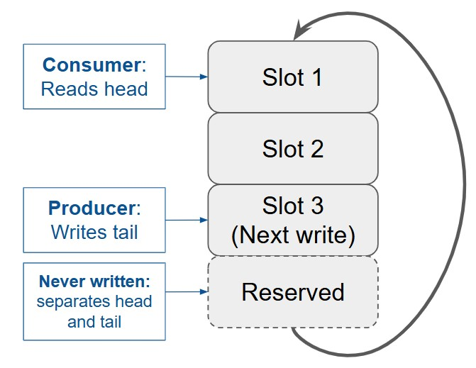
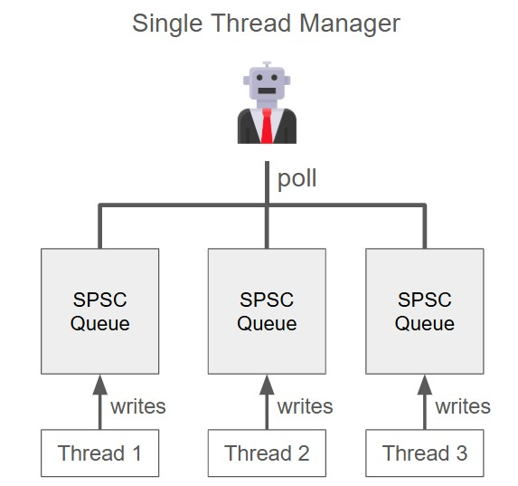
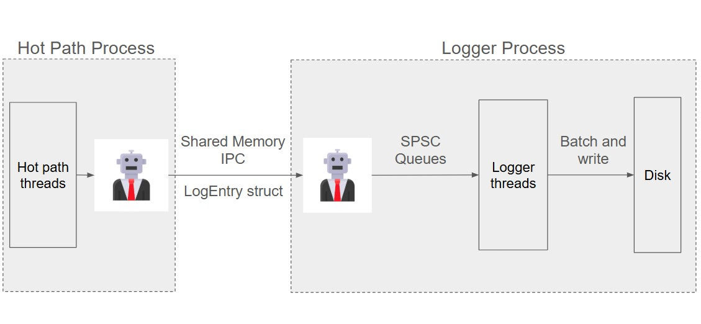

# Lock-Free MPSC Logger

## Overview
A lock-free Multiple Producer Single Consumer (MPSC) logging architecture built in C++17, designed for low-latency systems where the hot path must never block. Built from a lock-free SPSC queue primitive with cache line alignment, release/acquire memory ordering, and a fixed-size ring buffer. Eliminates mutex overhead, heap allocation jitter, and false sharing 
on the critical path.

---

## Architecture
The system is comprised of two primitives:
Hot path threads → [SPSC Queue × N] → MPSC Manager

Each hot path thread owns a dedicated SPSC queue, eliminating contention on shared state. The single consumer MPSC Manager polls all queues round-robin.

---

## SPSC Queue
### Architecture


The SPSC Queue is a fixed-size array that can hold N - 1 items of type T — one slot is reserved to distinguish full from empty without a separate counter. Since this is a queue, it follows a First-in-First-out (FIFO) architecture. An atomic size_t `head` holds the index of the current item to read, while an atomic size_t `tail` keeps track of the next memory block to write to. 

To instantiate a SPSCQueue:
```C++
SPSCQueue<T, N> queue; // N-1 capacity
```

### Design Decisions
#### Fixed-size ring buffer
The fixed-size ring buffer design means that we allocate an array of size N at initialisation, and never resize it again. The array is **zero-initialised** at construction, forcing the OS to map physical pages upfront and **eliminating page fault jitter on first access**. When the head and tail indices reach the end of the array, they wrap around to the front of the queue again. This design **eliminates the heap allocation jitter** when resizing, and **avoids pointer invalidation** when the allocator moves data to a new memory location during resize.

#### Unbounded indices with modulo on access
Head and tail grow unboundedly. When accessing the buffer, the actual slot is calculated with `index % N`. The reason is that bounded indices lose information: an index of 0 could mean no items have been written yet, or that exactly N items have been written and the index has wrapped back to the start. Unbounded indices preserve this information, and as a bonus `tail - head` gives the current occupancy of the queue at any point — useful for monitoring and sizing decisions.

#### N-1 usable capacity
The number of usable slots is N - 1. This is because we sacrifice one block of memory so that full and empty conditions are distinguishable by pointer position alone, without a separate counter. The N - 1 usable capacity thus allows us to establish two simple rules:
- `head == tail`: indicates the queue is **empty**, no items to read.
- `tail - head == N - 1`: indicates the queue is **full**, the next enqueue cause tail to overlap with head, making the state indistinguishable from empty.

Instantiate with `N = desired capacity + 1` to account for the reserved slot.

#### Cache line alignment
Since head and tail are instantiated within the same SPSCQueue class, it naturally makes them sit on the same cache line. This creates a case of **false sharing**: the producer constantly updates the tail index, while the consumer updates the head whenever it reads an item. The **cache coherency protocol (usually the MESI protocol)** marks the entire cache line as dirty when the producer writes to tail or consumer writes to head, forcing the next thread to **reload the entire cache line despite its own variables not being modified**.

The solution is to add padding such that head and tail reside on separate cache lines. In C++, the `std::hardware_destructive_interference_size` gives the cache line size of the current hardware, such that we can align head and tail to the start of separate cache lines with:
```C++
alignas(std::hardware_destructive_interference_size) std::atomic<size_t> head;
alignas(std::hardware_destructive_interference_size) std::atomic<size_t> tail;
```

#### Release/acquire memory ordering
The producer reads head to check for fullness and writes tail on enqueue. 
The consumer reads tail to check for items and writes head after reading. 
This creates two synchronisation pairs:

1. **tail** — producer releases on write, consumer acquires on read
2. **head** — consumer releases on write, producer acquires on read

Modern compilers and CPUs reorder instructions for performance. Without explicit ordering, a producer could store data to the buffer *after* advancing tail, causing the consumer to read uninitialised memory. Release/acquire prevents this:

```C++
std::atomic<bool> ready{false};
int val = 0;

// Thread 1 (producer)
val = 100;
ready.store(true, std::memory_order_release); // guarantees val=100 visible

// Thread 2 (consumer)
if (ready.load(std::memory_order_acquire)) {
    assert(val == 100); // guaranteed
}
```

**Acquire** ensures no memory operations after the load are reordered before it — the loading thread sees all writes made before the matching release. 
**Release** ensures no memory operations before the store are reordered after it — all prior writes are visible to the acquiring thread.

Sequentially consistent ordering is not needed here as only one thread ever writes to each pointer — no total global order across multiple atomics is required.

#### Deleted copy and move
Copy and move constructors are explicitly deleted to prevent accidental misuse — the compiler would otherwise generate them by default, and both are unsafe for this type:
- **Copy** — copying a live concurrent queue has no safe semantic. Items 
  may be enqueued or dequeued mid-copy, producing a snapshot that never 
  represented a consistent state.

- **Move** — moving would require either a deep copy of the array 
  (expensive, defeats the fixed-size design) or storing the buffer behind 
  a pointer and transferring ownership. Both would reintroduce the heap allocation 
  jitter the design specifically eliminates.

#### No CAS loops
In traditional contention-prone architecture, the compare-and-swap (CAS) idiom is often used to establish a retry loop until an update is successful:
1. Load the current value and calculate desired value based on the loaded value.
2. Load and compare the variable with previous snapshot. If the values match, swap in our desired value.
3. If the values do not match, get a new snapshot of the variable retry with new desired value.

The CAS is computationally more expensive than an acquire/release barrier, as well as introducing unpredictability - threads could be livelocked trying to make the update when the value changes rapidly. In high-precision and low-latency systems, this uncertainty undermines the determinism of the system.

With our architecture, each thread is the sole owner of their own SPSC Queue, such that there is no contention. We can therefore safely transition to acquire/release memory ordering with better performance.

---

## MPSC Manager
### Architecture


The MPSC Manager coordinates N worker threads, each owning a private SPSCQueue. The manager polls each queue in round-robin order, dequeuing one item per thread per cycle and storing it in its own internal queue. 

Each WorkerThread is stored as a struct:

```C++
struct WorkerThread {
    // producer hot zone
    alignas(std::hardware_destructive_interference_size) SPSCQueue queue;
    std::atomic totalEnqueued{0};
    std::atomic droppedByProducer{0};
    const int threadID = getID();

    // consumer hot zone
    alignas(std::hardware_destructive_interference_size) std::atomic totalDequeued{0};

    // control variable — touched by both
    alignas(std::hardware_destructive_interference_size) std::atomic state{State::Idle};

    // only touched when starting/stopping
    std::thread thread;
};
```

The queue, `totalEnqueued`, `droppedByProducer`, and `threadID` are grouped in the **producer hot zone** — variables the worker thread accesses constantly. `threadID` is `const` and never written after construction so it does not cause false sharing, but lives here for cache locality since the producer reads it on every enqueue to populate the `LogEntry`. `totalDequeued` lives on its own cache line as it is frequently updated by the manager (consumer), isolating it to avoid **false sharing** with the producer hot zone. `state` is on its own cache line as it is written by the manager and read by the worker thread — placing it in either hot zone would cause the other thread to 
invalidate it on every write.

### Design Decisions
#### Round-robin polling
The manager polls each worker thread's queue once per cycle in round-robin order. This is the simplest implementation for a minimum viable product. Since all worker threads perform identical work with the same load, we can reasonably expect no significant starvation or 
livelock between threads.

If thread throughput varies significantly, a more sophisticated scheduling algorithm would be warranted. For example, prioritising fuller queues, or only polling a queue once it reaches a minimum fill threshold (e.g. 50% capacity) to ensure the manager handles  higher-load threads first while slower threads accumulate naturally.

#### Mechanical sympathy — manager's internal queue
The manager's internal queue uses the same ring buffer logic as the 
SPSCQueue, but without atomic operations. Since the manager is 
single-threaded, there is no contention on its internal queue's head 
and tail — plain `size_t` indices and direct array access are sufficient.

Using `std::atomic` with memory barriers where no concurrency exists 
would impose unnecessary overhead on every enqueue and dequeue operation. 
Removing them honours the principle of **mechanical sympathy** — only 
pay for what you actually need.

#### Drop on full
Both the SPSCQueue and the manager's internal queue **drop items when full**. This is a deliberate design decision to ensure the hot path thread never blocks — it is counterintuitive for a thread to wait for a queue to clear so it can log the work it is now being kept from doing.

The alternatives were considered and rejected:

- **Overwriting oldest items**: This does not solve the problem of lost data, it just changes which data is lost. In a logging system, every entry has **diagnostic value** and the **integrity of the complete sequence** matters. Overwriting silently removes evidence needed to reconstruct the sequence of events leading to a fault. A dropped new entry is a known unknown — you can see the gap in timestamps. An overwritten old entry is an unknown unknown — the log appears complete but is silently missing data.

- **Resizing the queues**: Reintroduces **heap allocation jitter** and risks **pointer invalidation** if the allocator moves the array to a new memory location during expansion.

- **Temporary backup store**: A band-aid that adds more memory management overhead and requires checking two queues per thread instead of one.

- **Increasing initial queue size**: The most feasible option. The correct size is informed by monitoring how many items are actually dropped under peak load, which is covered in the next section.

#### Monitoring dropped items
Dropping items on full is a deliberate design decision, but silently dropping items with no visibility would make it impossible to tune queue sizes for production loads. Two counters provide this visibility:

- `droppedByProducer` — owned by the WorkerThread, incremented by the worker thread when the SPSCQueue is full. Signals that worker queues are too small or the manager is polling too slowly.

- `droppedByManager` — owned by the MPSCManager, incremented when the manager's internal queue is full. Signals that the manager queue is too small or the downstream consumer is too slow.

Keeping these counters separate is intentional — conflating them into one counter would obscure *where* in the pipeline the bottleneck is occurring. Each counter points to a distinct failure mode with a distinct fix.

These counters, alongside `totalEnqueued` and `totalDequeued`, expose **queue performance metrics** through the WorkerThread wrapper — an **observer pattern** that keeps the SPSCQueue lean and encapsulated while allowing external monitoring without coupling to queue internals.

#### Testing

##### Bounding thread output for deterministic testing
The worker thread's default behaviour is to enqueue items indefinitely — if the queue is full, the enqueue is dropped and retried with the same value until it succeeds. This makes blackbox testing impractical: insert bounded input, match output to expectations. Running the manager for 100ms on a typical machine produces ~400 items per thread, making it impossible to write stable assertions.

The solution is a `std::optional<int> target` parameter passed to the WorkerThread constructor and captured by the lambda:

- `std::nullopt` — the thread enqueues indefinitely (production behaviour)
- `int n` — the thread enqueues exactly n items then idles until stopped

This preserves the production code path while enabling deterministic testing without a separate debug build.

##### Parameter pack expansion
Reference: https://en.cppreference.com/w/cpp/utility/integer_sequence

Since WorkerThread no longer has a default constructor, initialising `std::array<WorkerThread, N>` requires passing `target` to each element at construction. Since N is a compile-time template parameter, we need a way to statically generate N `WorkerThread(target)` constructions. 

The solution is the index sequence trick:

```C++
template 
static auto make_workers(std::optional val, std::index_sequence) {
    return std::array<WorkerThread, sizeof...(Is)>{ ((void)Is, WorkerThread(val))... };
}
```

`std::index_sequence<Is...>` generates a compile-time pack of N indices. For each index `Is`, the comma operator evaluates `(void)Is` and discards it, leaving `WorkerThread(val)`. The `(void)` cast suppresses compiler warnings about the unused index. The result is N `WorkerThread(val)` constructions expanded into the array initialiser at compile time.

##### Correctness assertions
The test constructs an MPSCManager with 3 threads and a target of 10 items each, then verifies:

- `totalEnqueued == target` for each thread
- `totalEnqueued == totalDequeued` for each thread — no items lost
- Payloads arrive in order per thread — ring buffer ordering preserved
- `threadID` in each log matches the originating thread
- `droppedByManager == 0` — manager queue sized sufficiently

---

## Future Extensions
### Inter-process Logging System


The current MPSC architecture can be extended into a full inter-process logging system by mirroring the architecture on the logger side. The logger process manager distributes incoming log entries to logger threads via dedicated SPSC queues. The logger threads reconstruct each log entry into human readable text, batch multiple entries, and write to disk.

### Design Decisions

#### Shared Memory IPC
Shared memory allows LogEntries to be written directly into a memory region visible to both processes, eliminating the kernel context switch and memory copy overhead of traditional socket-based IPC. The process of bypassing the kernel as the middleman between the hot path process and the logger process is a practical example of **kernel bypass**.

#### Round-robin distribution of work
There are two ways to allocate work to the logger threads:

- **Greedy**: Logger threads directly compete to dequeue from the manager's internal queue
- **Round-robin**: The manager individually enqueues work to each logger thread's dedicated SPSC queue

The greedy approach violates the single consumer invariant of the SPSC design. Multiple threads competing on the same head pointer would require CAS loops to handle contention, reintroducing the non-deterministic retry behaviour the SPSC design was specifically built to avoid.

Round-robin distribution is therefore the logical solution. Each logger thread owns its queue exclusively, preserving single ownership and keeping acquire/release ordering sufficient.

#### Batch and write
Disk writes are expensive — each write involves a kernel context switch and physical I/O that is orders of magnitude slower than memory access. Batching multiple log entries before each write reduces the number of disk operations proportionally.

Each logger thread accumulates a configurable number of reconstructed log entries before flushing to disk. On graceful shutdown, any remaining unbatched entries are flushed before the logger process exits — ensuring no data is lost at the boundary.

#### Inter-process
Process separation of worker process from logging process ensures that the log survives if the hot path process crashes, and we now have data leading up to the crash to diagnose the problem. Moreover, it decouples logging logic from the hot path process, upholding encapsulation and single responsibility principles.

### Stateful SPSC Queue
The inter-process logging system reveals a gap in fault recovery. If a worker thread crashes mid-write, the slot may contain a partially written entry with no way to distinguish it from a complete one. If a logger thread crashes mid-read, it loses its position in the queue and has no way to recover to its pre-crash state.

The natural solution is a state transition system — a single enum replacing individual flags, representing every possible state a slot can be in:

`Read → Writing → Written → Reading → Read`

This allows the producer to only overwrite slots in the `Read` state, the consumer to only read slots in the `Written` state, and a restarting logger to scan for `Reading` (crashed mid-read) or `Written` (never read) to recover its position.

Introducing state logic requires extending the currently stateless SPSCQueue with state transition mechanics. The natural implementation is CRTP — the base SPSCQueue handles ring buffer mechanics, while the derived StatefulSPSCQueue implements the state policy. CRTP is chosen over virtual dispatch to eliminate vtable overhead, aligning with the core design goal of minimising latency at every layer.


## Building
Requires C++ 20 or later.
### SPSCTest
#### Windows (Developer Powershell)
`cl /std:c++20 /EHsc SPSCTest.cpp /I include`
#### Linux/Mac
`g++ -std=c++20 -o spsc_test SPSCTest.cpp -I include`

### MPSCTest
#### Windows (Developer Powershell)
`cl /std:c++20 /EHsc MPSCTest.cpp /I include`
#### Linux/Mac
`g++ -std=c++20 -o mpsc_test MPSCTest.cpp -I include`

## Repository Structure
```
lock-free-logger/
    include/
        SPSCQueue.h       — SPSC queue template
        WorkerThread.h    — worker thread struct with state machine
        MPSCManager.h     — MPSC manager coordinating worker threads
        LogEntry.h        — fixed-size log entry struct
    src/
        SPSCTest.cpp      — correctness test for the SPSC architecture
        MPSCTest.cpp      — correctness test for the MPSC architecture
    README.md
    .gitignore
```